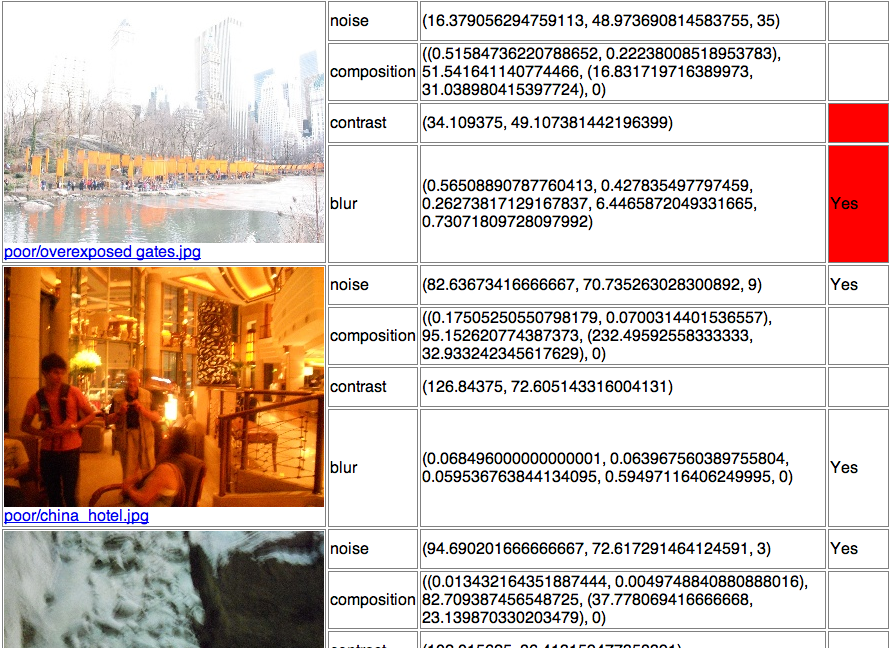

Image Quality Analysis Final Project
====================================

This is my final project code for Computational Vision.
**I really wish I could improve the quality of code at some point.**
This was created in approximately two weeks, which includes figuring
out how to compile and learn OpenCV.

Prerequisites
-------------

You'll need OpenCV and Numpy to run this.

Configuration
--------------

The main entry point is main.py.

Not all the options are available for configuration on the command line,
so you'll have to manually edit the main.py code (which is messy, I know).

Near the top of main.py are the features we're using::

    measurements = (
        contrast,
        noise,
        blur,
        composition,
        #faces, # => under composition
    )

Uncomment or comment the features you wish the analyzer to use. Blur is
the longest to compute on average and composition is incomplete.

If you want to change/add some training data...::

    california_night = TrainingData('good/Another Beautiful California Night.jpg',
        measures=measurements, kind='good',
    )

These (and other lines like it) list some test images. Currently, they are
not included with the project yet::

    li_dir = load_images_from('li')
    chow_dir = load_images_from('chow')
    china_dir = load_images_from('/Users/jeff/Desktop/china-day6/full')

This contains a collection of images to use. You can create your own here.
But you'll need to modify the switch case below it::

    if options.imageset:
        if options.imageset == 'li':
            process(li_dir)
            return 0
        elif options.imageset == 'chow':
            process(chow_dir)
            return 0
        elif options.imageset == 'china':
            process(china_dir)
            return 0
        elif options.imageset == 'custom':
            process()
            return 0

Inside the process() function, there is a max_size argument::

    max_size = None#(800, 600)

Setting it to a 2-tuple restricts the width or height to the given value
if the image is greater than the given size. This only applies to image sets.

Similarly, there's an identical one for single images in the main()::

    size = None #(320,240,'crop') # (0.5, 0.5, 'resize-p')
    if size is None:
        im = tdata.load()
    elif size[-1] == 'crop':
        im = image.random_cropped_region(tdata.load(), size[:2])
    elif size[-1] == 'resize':
        im = tdata.load(size[:2])
    elif size[-1] == 'resize-p':
        im = image.resize(tdata.load(), by_percent=size[:2])
    else:
        raise TypeError, "Invalid image sizing type."

The size argument takes a 3-tuple, the first two are sizes, and the last
is the method to reduce the size. 'resize-p' resizes by percent (in 
decimal form), while 'crop' crops a random region in the image. 'resize' is
identical to max_size argument.

Usage
---------

To use, run main.py on an image set::

    python main.py --imageset=custom

The results are placed in output.html. If you want to run on only one image,
use the file argument::

    python main.py --file=/path/to/file.jpg

You can also pass the debug flag to see intermediary image processing 
steps::

    python main.py --file=/path/to/file.jpg -d # Don't run this!

But **this creates a ALOT of debugging windows**. You'll want to see the
debugging information for one feature, use the --type argument::

    python main.py --file="/path/to/file.jpg" -d --type=blur

And that is all for now.